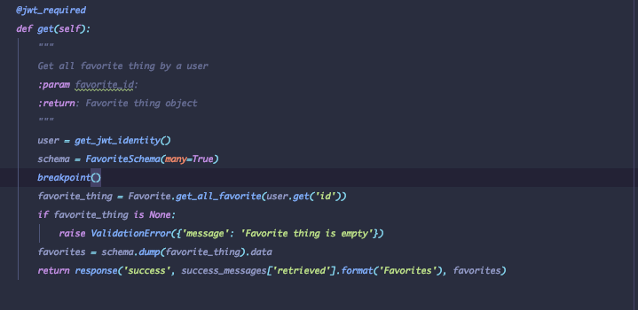

####  How long did you spend on the coding test below
- I spent approximately  75 hours

####  What would you add to your solution if you had more time
    -  If i had more time i would have implemented caching in order to make application loads faster.
    - Register my API's to an APM tools, in order to keep track of my endpoints.
#### The most useful feature that was added to the latest version of my chosen language that i used on my project
    1. breakpoint() - The break point function is a builtin python debugger which set to replace the python (pdb) to make testing intuitive and flexible
  

#### How would you track down a performance issue in production
    1.Identify the bottleneck : 
         I will start by using logging or monitoring tool like (StackDriver, Elsatic Stack or Datadog) to monitor request-response and trace the application functions
    2.I will try to check why there was an issue in the first place, it is coming from the front end or backend
    3.making use of my browser dev tools come in handy e.g(chrome dev tools)